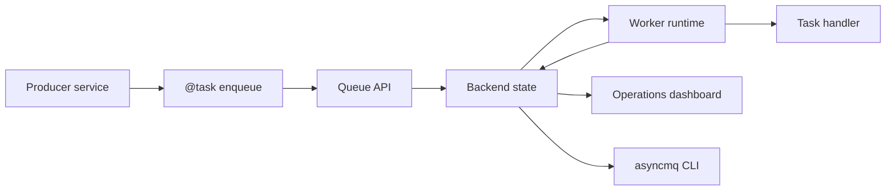

# AsyncMQ

<p align="center">
  <a href="https://asyncmq.dymmond.com"></a>
</p>

<p align="center">
  <strong>Async task queues, workers, retries, scheduling, and operations visibility for Python.</strong>
</p>

<p align="center">
  <a href="https://github.com/dymmond/asyncmq/actions/workflows/test-suite.yml/badge.svg?event=push&branch=main" target="_blank">
    
  </a>
  <a href="https://pypi.org/project/asyncmq" target="_blank">
    
  </a>
  <a href="https://img.shields.io/pypi/pyversions/asyncmq.svg?color=%2334D058" target="_blank">
    
  </a>
</p>

---

**Documentation**: [https://asyncmq.dymmond.com](https://asyncmq.dymmond.com)

**Source Code**: [https://github.com/dymmond/asyncmq](https://github.com/dymmond/asyncmq)

**Supported Version**: the latest released version is the supported version.

---

AsyncMQ is a library-first background job runtime for `asyncio` and `anyio`
applications. It gives Python services a native queue API, worker runtime,
retry and dead-letter behavior, repeatable scheduling, flow primitives,
multiple backends, a CLI, and a packaged Lilya/Jinja operations dashboard.

## Why AsyncMQ

- Python-native task registration with `@task`, `.enqueue()`, `.delay()`, and `.send()`.
- Queue and worker APIs for retries, backoff, delayed jobs, cancellation, pause/resume, cleanup, and DLQ operations.
- Backend options for Redis, PostgreSQL, MongoDB, RabbitMQ, and in-memory development.
- A production operations console that is packaged with AsyncMQ and works without Node.js or a frontend build pipeline.
- Clear runtime ownership: workers own execution, backends own durable queue state, and the dashboard consumes that state.

AsyncMQ is not a hosted queue service and does not promise exactly-once
execution. Production task handlers should be idempotent and safe to retry.

## Install

```bash
pip install asyncmq
```

Optional backend extras:

```bash
pip install "asyncmq[postgres]"
pip install "asyncmq[mongo]"
pip install "asyncmq[aio-pika]"
pip install "asyncmq[all]"
```

## Quickstart

Start with the in-memory backend for local development:

```python
# myapp/settings.py
from asyncmq.backends.memory import InMemoryBackend
from asyncmq.conf.global_settings import Settings


class AppSettings(Settings):
    backend = InMemoryBackend()
    worker_concurrency = 1
```

```bash
export ASYNCMQ_SETTINGS_MODULE=myapp.settings.AppSettings
```

Define a task:

```python
# myapp/tasks.py
from asyncmq.tasks import task


@task(queue="emails", retries=2, ttl=300)
async def send_welcome(email: str) -> str:
    return f"sent welcome email to {email}"
```

Enqueue work:

```python
# producer.py
import anyio

from asyncmq.queues import Queue
from myapp.tasks import send_welcome


async def main() -> None:
    queue = Queue("emails")
    job_id = await send_welcome.enqueue("alice@example.com", backend=queue.backend)
    print("enqueued", job_id)


anyio.run(main)
```

Run a worker:

```bash
asyncmq worker start emails --concurrency 1
```

Inspect from the CLI:

```bash
asyncmq queue list
asyncmq queue info emails
asyncmq job list --queue emails --state waiting
asyncmq job list --queue emails --state failed
```

## Production Backend Example

Use a shared backend configuration for producers, workers, and the dashboard.

```python
# myapp/settings.py
from asyncmq.backends.redis import RedisBackend
from asyncmq.conf.global_settings import Settings
from asyncmq.core.utils.dashboard import DashboardConfig


class AppSettings(Settings):
    secret_key = "replace-with-a-secret-from-your-secret-manager"
    backend = RedisBackend("redis://redis:6379/0")
    worker_concurrency = 8
    scan_interval = 1.0

    @property
    def dashboard_config(self) -> DashboardConfig:
        return DashboardConfig(
            secret_key=self.secret_key,
            dashboard_url_prefix="/asyncmq",
            path="/asyncmq",
            https_only=True,
        )
```

Workers and the dashboard can run in different services as long as they use the
same `ASYNCMQ_SETTINGS_MODULE` and backend credentials.

## Operations Dashboard

AsyncMQ includes a native dashboard built with Lilya, server-rendered Jinja
templates, and packaged static assets.

```python
# myapp/dashboard.py
from lilya.apps import Lilya

from asyncmq.contrib.dashboard.admin import AsyncMQAdmin

app = Lilya()
admin = AsyncMQAdmin(
    enable_login=True,
    backend=auth_backend,  # Provide an AuthBackend implementation.
    url_prefix="/asyncmq",
)
admin.include_in(app)
```

The dashboard supports queue inspection, worker health, job lists, failed-job
tracebacks, DLQ actions, repeatables, metrics, runtime events, audit history,
and reverse-proxy deployments at `/`, `/asyncmq/`, and nested prefixes such as
`/operations/asyncmq/`.

Read the [Dashboard guide](https://asyncmq.dymmond.com/dashboard/dashboard/) for
authentication, separate dashboard/worker services, proxy setup, and Nginx
examples.

## Runtime Shape



## Documentation Map

- [Installation](https://asyncmq.dymmond.com/installation/)
- [Quickstart](https://asyncmq.dymmond.com/features/quickstart/)
- [Core Concepts](https://asyncmq.dymmond.com/features/core-concepts/)
- [Queues](https://asyncmq.dymmond.com/features/queues/)
- [Workers](https://asyncmq.dymmond.com/features/workers/)
- [Jobs](https://asyncmq.dymmond.com/features/jobs/)
- [Schedulers](https://asyncmq.dymmond.com/features/schedulers/)
- [Flows](https://asyncmq.dymmond.com/features/flows/)
- [CLI Reference](https://asyncmq.dymmond.com/reference/cli-reference/)
- [Dashboard](https://asyncmq.dymmond.com/dashboard/dashboard/)
- [Production Operations](https://asyncmq.dymmond.com/learn/production-operations/)
- [Troubleshooting](https://asyncmq.dymmond.com/troubleshooting/)
