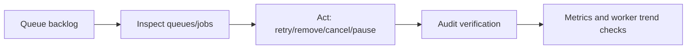

# Dashboard Capabilities

This page maps the current AsyncMQ dashboard behavior against Flower-style operational expectations.

## Capability Matrix

| Capability | Status | What you get today |
| --- | --- | --- |
| Queue visibility (waiting/active/delayed/failed/completed) | Supported | Overview + queue pages + SSE updates |
| Worker list and heartbeat visibility | Supported | `/workers` with heartbeat timestamps and pagination |
| Queue pause/resume control | Supported | Queue overview and queue detail forms |
| Job listing with filtering/search | Supported | State tabs + full-text payload search + task/job-id filters + sorting |
| Job retry/remove/cancel controls | Supported | Single-action endpoint and bulk form flow |
| DLQ inspection and retry/remove | Supported | Queue-scoped DLQ page and actions |
| Repeatable definition pause/resume/remove/create | Supported | Repeatables list + new repeatable page |
| Live dashboard updates | Supported | SSE stream (`/events`) |
| Action audit trail | Supported | `/audit` page with filtering and text search |
| Metrics trend history in dashboard | Supported | `/metrics` page + `/metrics/history` JSON endpoint |
| Remote worker process control (start/stop/scale) | Not available | Use CLI + process supervisor/orchestrator |
| Multi-cluster federation view | Not available | One configured backend context per deployment |
| Built-in fine-grained RBAC | Partial | Pluggable auth backend; app controls authorization model |

## Flow Coverage Snapshot

## Backend Notes

The dashboard follows the configured AsyncMQ backend and uses the backend contract (`list_jobs`, `retry_job`, `queue_stats`, etc.).

Practical implications:

- Data freshness and ordering depend on backend behavior.
- Metrics history is process-local memory for dashboard snapshots, not a long-term analytics database.
- Cross-process dashboard instances do not automatically merge history/audit memory.

## What This Means Operationally

AsyncMQ dashboard is production-usable for:

- queue triage
- failed-job recovery
- worker visibility
- operator action traceability
- short-window trend checks

It is not a full worker fleet control plane.

For process lifecycle and infra control, use:

- CLI (`asyncmq worker ...`)
- your orchestrator (systemd, Kubernetes, Nomad, ECS, etc.)
- external monitoring/logging systems for long-term storage
