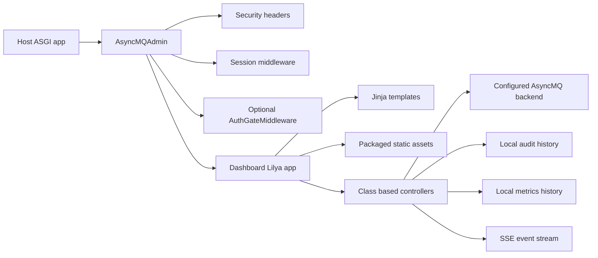

# Dashboard

AsyncMQ ships a native operations dashboard in `asyncmq.contrib.dashboard`.
It is a Lilya application rendered with Jinja templates, packaged with AsyncMQ,
and usable without Node.js or a frontend build pipeline.

Use it for day-to-day queue operations, incident response, and production
inspection:

- queue, job, worker, DLQ, repeatable, metrics, event, and audit visibility
- retry, cancel, remove, pause, resume, drain, and purge operations where the
  configured backend supports them
- failed-job diagnostics with redacted payload metadata, root cause, exception
  chain, stack-frame summaries, and raw traceback access
- reverse-proxy-aware URLs for direct, mounted, and nested deployments

Related pages:

- [Dashboard Capabilities](capabilities.md)
- [Dashboard Operations Playbook](operations.md)
- [Authentication Backends](jwt.md)

## Architecture

Wrapper class: `AsyncMQAdmin`



AsyncMQ runtime state remains the source of truth. The dashboard renders and
acts on backend/runtime contracts; it does not invent queue, worker, job,
failure, retry, or health state in the browser.

| Component | Owner | Notes |
| --- | --- | --- |
| Execution state | AsyncMQ runtime and backend | Queue counts, jobs, workers, retries, failures, DLQ state |
| Durable queue data | Configured backend | Redis, PostgreSQL, MongoDB, RabbitMQ, or in-memory backend capabilities differ |
| Audit history | Dashboard process | Bounded local evidence of dashboard actions |
| Metrics history | Dashboard process | Bounded local snapshots for the operations console |
| Templates | Dashboard package | Server-rendered Jinja remains the primary rendering layer |
| Alpine.js | Dashboard static package | Progressive interaction only; loaded from packaged assets |
| Tailwind CSS | Dashboard static package | Vendored CSS asset; no runtime CDN or build step |

## Route Map

| Area | Route | Purpose |
| --- | --- | --- |
| Overview | `/` | Queue, job, worker, latest job, and chart summary |
| Queues | `/queues` | Queue list, state counts, pause/resume controls |
| Queue details | `/queues/{name}` | Per-queue counts, operations, and navigation |
| Jobs | `/queues/{name}/jobs` | Server-side state filters, search, sorting, pagination |
| Job detail | `/queues/{name}/jobs/{job_id}` | Runtime-owned metadata, redacted payloads, diagnostics |
| DLQ | `/queues/{name}/dlq` | Dead-letter inspection and confirmation-gated actions |
| Repeatables | `/queues/{name}/repeatables` | Durable repeatable definitions and safe controls |
| Workers | `/workers` | Worker status, queues, concurrency, heartbeat freshness |
| Metrics | `/metrics` | Throughput, retries, failures, and queue distribution |
| Prometheus metrics | `/metrics/prometheus` | Scrape-friendly queue and worker gauges |
| Metrics history | `/metrics/history` | JSON history snapshots |
| Event stream | `/events` | Server-sent live update stream |
| Event history | `/events/history` | Bounded local runtime event evidence |
| Audit trail | `/audit` | Bounded dashboard action history |
| Login | `/login` | Optional authenticated dashboard entrypoint |
| Logout | `/logout` | Session logout when authentication is enabled |

All paths above are relative to the dashboard mount prefix. If the dashboard is
mounted at `/asyncmq`, the queue list is `/asyncmq/queues`.

## Install And Enable

The dashboard requires Lilya because it is a Lilya contrib application.
Install AsyncMQ normally and include Lilya in the environment where the
dashboard process runs.

```shell
pip install asyncmq lilya
```

No Node.js, npm, pnpm, Vite, Webpack, or public CDN is required. Alpine.js,
Tailwind CSS, the dashboard CSS, JavaScript, icons, and templates are packaged
as AsyncMQ resources and are loaded from the dashboard static route.

## New Lilya Application

Use this pattern when the dashboard is part of a new Lilya service.

```python
from lilya.apps import Lilya

from asyncmq.contrib.dashboard.admin import AsyncMQAdmin

app = Lilya()

admin = AsyncMQAdmin(
    enable_login=False,  # Use only for local development or private test networks.
    url_prefix="/asyncmq",
)
admin.include_in(app)
```

The dashboard is available at:

```text
/asyncmq/
```

For production, enable authentication before exposing the app.

## Existing Lilya Application

Use `include_in()` to add the dashboard to an existing Lilya application.

```python
from lilya.apps import Lilya

from asyncmq.contrib.dashboard.admin import AsyncMQAdmin
from asyncmq.contrib.dashboard.admin.backends.simple_user import SimpleUsernamePasswordBackend
from asyncmq.contrib.dashboard.admin.protocols import User


def verify_user(username: str, password: str) -> User | None:
    if username == "ops" and password == "replace-me":
        return User(id="ops", name="Operations", is_admin=True, roles=("asyncmq:admin",))
    return None


app = Lilya()

admin = AsyncMQAdmin(
    enable_login=True,
    backend=SimpleUsernamePasswordBackend(verify_user),
    url_prefix="/asyncmq",
    include_session=True,
    include_cors=False,
)
admin.include_in(app)
```

`SimpleUsernamePasswordBackend` is useful for small deployments and tests. For
identity-provider-backed deployments, implement `AuthBackend` or use the JWT
backend described in [Authentication Backends](jwt.md).

## Existing FastAPI Or Starlette Application

For non-Lilya hosts, mount the dashboard ASGI app. The tested pattern is to
mount an outer path and ask AsyncMQ to include the configured dashboard prefix
inside that mounted application.

```python
from fastapi import FastAPI

from asyncmq.contrib.dashboard.admin import AsyncMQAdmin

app = FastAPI()

admin = AsyncMQAdmin(
    enable_login=False,
    url_prefix="/asyncmq",
)

app.mount("/ops", admin.get_asgi_app(with_url_prefix=True))
```

The public dashboard URL is:

```text
/ops/asyncmq/
```

The same pattern is covered by the Starlette tests:

```python
from starlette.applications import Starlette
from starlette.routing import Mount

from asyncmq.contrib.dashboard.admin import AsyncMQAdmin

admin = AsyncMQAdmin(enable_login=False, url_prefix="/asyncmq")

app = Starlette(
    routes=[
        Mount("/ops", admin.get_asgi_app(with_url_prefix=True)),
    ]
)
```

## Dashboard Service And Worker Services

The dashboard can run in its own ASGI service while workers run in separate
processes, containers, hosts, or orchestration units. They are linked by the
same AsyncMQ settings and backend, not by importing each other.

Use the same `ASYNCMQ_SETTINGS_MODULE` for the dashboard service and every
worker service, or ensure the settings classes resolve to the same backend,
queue names, serialization settings, and backend credentials.

```python
# myapp/settings.py
from asyncmq.backends.redis import RedisBackend
from asyncmq.conf.global_settings import Settings
from asyncmq.core.utils.dashboard import DashboardConfig


class AppSettings(Settings):
    secret_key = "replace-with-a-secret-from-your-secret-manager"
    backend = RedisBackend("redis://redis:6379/0")

    @property
    def dashboard_config(self) -> DashboardConfig:
        return DashboardConfig(
            secret_key=self.secret_key,
            dashboard_url_prefix="/asyncmq",
            path="/asyncmq",
            https_only=True,
        )
```

Dashboard service:

```shell
ASYNCMQ_SETTINGS_MODULE=myapp.settings.AppSettings \
uvicorn myapp.dashboard:app --host 0.0.0.0 --port 8000
```

Worker service:

```shell
ASYNCMQ_SETTINGS_MODULE=myapp.settings.AppSettings \
python -m myapp.workers
```

Dashboard app:

```python
# myapp/dashboard.py
from lilya.apps import Lilya

from asyncmq.contrib.dashboard.admin import AsyncMQAdmin
from asyncmq.contrib.dashboard.admin.backends.simple_user import SimpleUsernamePasswordBackend
from asyncmq.contrib.dashboard.admin.protocols import User


def verify_user(username: str, password: str) -> User | None:
    if username == "ops" and password == "replace-me":
        return User(id="ops", name="Operations", is_admin=True)
    return None


app = Lilya()
auth_backend = SimpleUsernamePasswordBackend(verify_user)
admin = AsyncMQAdmin(enable_login=True, backend=auth_backend, url_prefix="/asyncmq")
admin.include_in(app)
```

Worker app:

```python
# myapp/workers.py
from asyncmq import Queue, Worker

queue = Queue("emails")
worker = Worker(queue)

if __name__ == "__main__":
    worker.run()
```

Operational rules:

- The dashboard sees queues and jobs only from the configured backend.
- Worker status, heartbeat freshness, current jobs, reserved jobs, scheduled
  jobs, queues, concurrency, and startup metadata appear only when the worker
  runtime records those fields.
- Logs and traces should still be sent to your normal logging/observability
  system. The dashboard event and audit histories are bounded local evidence,
  not durable centralized log storage.
- If dashboard and workers use different settings modules, backend URLs,
  database names, queue prefixes, serializers, or credentials, they are looking
  at different systems.

## Dashboard Configuration

`settings.dashboard_config` returns `DashboardConfig`. Use it to configure the
dashboard title, mount prefix, session cookie, secure cookie behavior, CORS, and
trusted reverse proxies.

```python
from asyncmq.conf.global_settings import Settings
from asyncmq.core.utils.dashboard import DashboardConfig


class AppSettings(Settings):
    secret_key = "replace-with-a-secret-from-your-secret-manager"

    @property
    def dashboard_config(self) -> DashboardConfig:
        return DashboardConfig(
            title="AsyncMQ Operations",
            header_title="AsyncMQ",
            description="Queue operations console",
            dashboard_url_prefix="/asyncmq",
            secret_key=self.secret_key,
            session_cookie="asyncmq_ops",
            same_site="lax",
            https_only=True,
            path="/asyncmq",
            trusted_proxies=("10.0.0.10",),
        )
```

Important production settings:

| Setting | Production guidance |
| --- | --- |
| `secret_key` | Set a stable secret from a secret manager. Do not rely on generated process-local keys in production. |
| `dashboard_url_prefix` | Match the internal dashboard mount, commonly `/asyncmq`. |
| `session_cookie` | Use a service-specific cookie name. |
| `path` | Scope cookies to the dashboard prefix when the dashboard is not at the app root. |
| `same_site` | Keep `lax` unless your identity flow requires a different policy. |
| `https_only` | Use `True` behind HTTPS. |
| `trusted_proxies` | Include only reverse-proxy peer addresses allowed to supply forwarded host/proto headers. |

## Authentication And Authorization

Set `enable_login=True` and provide an `AuthBackend`.

```python
admin = AsyncMQAdmin(
    enable_login=True,
    backend=auth_backend,
    require_admin=True,
)
```

By default, authenticated users must be dashboard admins. To authorize by role
membership instead, pass roles and set `require_admin=False`:

```python
admin = AsyncMQAdmin(
    enable_login=True,
    backend=auth_backend,
    require_admin=False,
    required_roles=("ops", "asyncmq:admin"),
)
```

`AuthBackend.authenticate()` runs on each request. `login()` and `logout()` own
the `/login` and `/logout` flows. The dashboard stores session data through the
configured Lilya session middleware when `include_session=True`.

## CORS And Mutating Requests

CORS is closed by default. `AsyncMQAdmin(include_cors=True)` installs CORS only
when explicit origins are configured.

```python
admin = AsyncMQAdmin(
    enable_login=True,
    backend=auth_backend,
    cors_allow_origins=("https://ops.example.com",),
    cors_allow_credentials=True,
)
```

Do not use wildcard origins for authenticated dashboards. AsyncMQ rejects
`cors_allow_origins=("*",)` when `cors_allow_credentials=True`.

When login is enabled, unsafe requests such as `POST` must be same-origin by
default. This protects queue and job operations from cross-origin form
submissions. Set `enforce_same_origin=False` only when a trusted gateway already
enforces equivalent origin rules before traffic reaches AsyncMQ.

## Security Headers

`AsyncMQAdmin(include_security=True)` is the default. It adds dashboard security
headers, including a strict Content Security Policy:

- `default-src 'self'`
- `script-src 'self'`
- `style-src 'self'`
- `connect-src 'self'`
- `form-action 'self'`
- `frame-ancestors 'none'`

The packaged dashboard does not require `unsafe-inline` or `unsafe-eval`.
Alpine.js and dashboard behavior are loaded from packaged JavaScript files.

If an outer application owns all security headers, set `include_security=False`
and configure equivalent or stronger headers there.

## Reverse Proxy Deployments

The dashboard is prefix-aware through Lilya mount and ASGI `root_path`
handling. The validated Nginx proof lives in `tests/dashboard/nginx/` and uses
a real browser to verify:

- pages, forms, redirects, navigation, login, logout, queue actions, workers,
  and failed-job diagnostics
- CSS, Alpine.js, and static assets under the effective prefix
- security headers
- no required failed network requests
- no browser console errors

Arbitrary public prefixes work when the proxy and application agree on the same
URL contract:

- `AsyncMQAdmin(url_prefix=...)` is the dashboard's internal mount prefix.
- `DashboardConfig.dashboard_url_prefix` is the fallback prefix used when Lilya
  has no non-empty mount path, especially for root deployments.
- ASGI `root_path` is the public prefix stripped by the proxy before requests
  reach the app server.
- `Host`, `X-Forwarded-Host`, `X-Forwarded-Proto`, and `X-Forwarded-Port`
  describe the public browser origin.
- `DashboardConfig.path` scopes the session cookie to the public dashboard path.

For a root deployment, configure both `AsyncMQAdmin(url_prefix="/")` and
`DashboardConfig.dashboard_url_prefix="/"`. Otherwise root pages have no
non-empty Lilya mount prefix to override the configured fallback.

### Validated URL Patterns

| Public URL | Dashboard prefix | ASGI root path | Proof command setting |
| --- | --- | --- | --- |
| `/` | `/` | empty | `ASYNCMQ_DASHBOARD_PREFIX=/` |
| `/asyncmq/` | `/asyncmq` | empty | default proof app prefix |
| `/operations/asyncmq/` | `/asyncmq` | `/operations` | `uvicorn --root-path /operations` |

### Nginx At Application Root

Run the dashboard with `url_prefix="/"` and
`DashboardConfig.dashboard_url_prefix="/"`:

```shell
ASYNCMQ_SETTINGS_MODULE=tests.dashboard.nginx.settings.NginxProofSettings \
ASYNCMQ_DASHBOARD_PREFIX=/ \
hatch -e test run uvicorn tests.dashboard.nginx.app:app \
  --host 127.0.0.1 \
  --port 8767
```

Proxy the public root to the upstream root:

```nginx
location / {
    proxy_pass http://upstream_asyncmq/;
    proxy_http_version 1.1;
    proxy_set_header Host $http_host;
    proxy_set_header X-Forwarded-Host $http_host;
    proxy_set_header X-Forwarded-Proto $scheme;
    proxy_set_header X-Forwarded-Port $server_port;
    proxy_set_header X-Forwarded-For $proxy_add_x_forwarded_for;
    proxy_set_header X-Real-IP $remote_addr;
    proxy_buffering off;
}
```

### Nginx At `/asyncmq/`

Run the dashboard with the default proof prefix:

```shell
ASYNCMQ_SETTINGS_MODULE=tests.dashboard.nginx.settings.NginxProofSettings \
hatch -e test run uvicorn tests.dashboard.nginx.app:app \
  --host 127.0.0.1 \
  --port 8767
```

Proxy the public `/asyncmq/` path to the upstream `/asyncmq/` route:

```nginx
location = /asyncmq {
    return 308 /asyncmq/;
}

location /asyncmq/ {
    proxy_pass http://upstream_asyncmq/asyncmq/;
    proxy_http_version 1.1;
    proxy_set_header Host $http_host;
    proxy_set_header X-Forwarded-Host $http_host;
    proxy_set_header X-Forwarded-Proto $scheme;
    proxy_set_header X-Forwarded-Port $server_port;
    proxy_set_header X-Forwarded-For $proxy_add_x_forwarded_for;
    proxy_set_header X-Real-IP $remote_addr;
    proxy_buffering off;
}
```

### Nginx At `/operations/asyncmq/`

Run the application server with an ASGI root path for the stripped public root:

```shell
ASYNCMQ_SETTINGS_MODULE=tests.dashboard.nginx.settings.NginxProofSettings \
hatch -e test run uvicorn tests.dashboard.nginx.app:app \
  --host 127.0.0.1 \
  --port 8767 \
  --root-path /operations
```

Proxy the nested public route to the upstream dashboard prefix:

```nginx
location = /operations/asyncmq {
    return 308 /operations/asyncmq/;
}

location /operations/asyncmq/ {
    proxy_pass http://upstream_asyncmq/asyncmq/;
    proxy_http_version 1.1;
    proxy_set_header Host $http_host;
    proxy_set_header X-Forwarded-Host $http_host;
    proxy_set_header X-Forwarded-Proto $scheme;
    proxy_set_header X-Forwarded-Port $server_port;
    proxy_set_header X-Forwarded-For $proxy_add_x_forwarded_for;
    proxy_set_header X-Real-IP $remote_addr;
    proxy_buffering off;
}
```

Preserve `$http_host`, including the port, for local and non-standard-port
deployments. Same-origin protection compares the public origin that the browser
uses with the origin the dashboard sees through trusted proxy headers.

### HTTPS Termination

When Nginx terminates HTTPS, forward the public scheme and port:

```nginx
proxy_set_header X-Forwarded-Proto https;
proxy_set_header X-Forwarded-Port 443;
proxy_set_header X-Forwarded-Host $http_host;
```

Configure `trusted_proxies` with the proxy peer addresses. AsyncMQ ignores
forged forwarded origin headers from untrusted direct clients.

### Other Proxies

Traefik, HAProxy, Caddy, and Kubernetes ingress controllers must provide the
same contract:

- preserve the public `Host`
- forward the public scheme and port
- configure the ASGI root path when a public prefix is stripped before the app
- keep static assets, redirects, form actions, and SSE requests under the same
  public prefix
- do not trust forwarded headers from arbitrary direct clients

For SSE at `/events`, disable response buffering or configure streaming support
for the dashboard route. The browser uses same-origin `EventSource`.

### Proxy Troubleshooting

| Symptom | Likely cause | Fix |
| --- | --- | --- |
| CSS or Alpine.js 404s | Public prefix and ASGI root path disagree | Check generated asset URLs and the proxy `proxy_pass` path |
| Login redirects to the wrong path | Missing or incorrect `root_path` | Pass the stripped public root to the ASGI server |
| Queue actions return `403` | Host, scheme, or port mismatch in origin checks | Preserve `Host`, `X-Forwarded-Host`, `X-Forwarded-Proto`, and `X-Forwarded-Port`; configure `trusted_proxies` |
| Login appears to work but session is lost | Cookie path or secure flag mismatch | Set `DashboardConfig.path` and `https_only` for the public deployment |
| Mixed content errors | HTTPS proxy forwards `http` as scheme | Forward `X-Forwarded-Proto https` |
| Live cards do not update | Proxy buffers SSE | Disable buffering for dashboard routes |

## Run The Proxy Proof

The root, subpath, and nested proof commands all use the same Nginx Docker
Compose file and Playwright browser script. Start the app server in one
terminal, then run the Docker Compose and proof commands in another terminal.

Root deployment app server:

```shell
ASYNCMQ_SETTINGS_MODULE=tests.dashboard.nginx.settings.NginxProofSettings \
ASYNCMQ_DASHBOARD_PREFIX=/ \
hatch -e test run uvicorn tests.dashboard.nginx.app:app \
  --host 127.0.0.1 \
  --port 8767
```

Root deployment proof:

```shell
docker compose -f tests/dashboard/nginx/docker-compose.yml up -d
ASYNCMQ_NGINX_BASE_URL=http://127.0.0.1:18080 \
ASYNCMQ_NGINX_SCREENSHOT_DIR=/tmp/asyncmq-nginx-proof-root \
hatch -e test run python tests/dashboard/nginx/proof.py
docker compose -f tests/dashboard/nginx/docker-compose.yml down
```

Subpath deployment app server:

```shell
ASYNCMQ_SETTINGS_MODULE=tests.dashboard.nginx.settings.NginxProofSettings \
hatch -e test run uvicorn tests.dashboard.nginx.app:app \
  --host 127.0.0.1 \
  --port 8767
```

Subpath deployment proof:

```shell
docker compose -f tests/dashboard/nginx/docker-compose.yml up -d
ASYNCMQ_NGINX_BASE_URL=http://127.0.0.1:18080/asyncmq \
ASYNCMQ_NGINX_SCREENSHOT_DIR=/tmp/asyncmq-nginx-proof-subpath \
hatch -e test run python tests/dashboard/nginx/proof.py
docker compose -f tests/dashboard/nginx/docker-compose.yml down
```

Nested deployment app server:

```shell
ASYNCMQ_SETTINGS_MODULE=tests.dashboard.nginx.settings.NginxProofSettings \
hatch -e test run uvicorn tests.dashboard.nginx.app:app \
  --host 127.0.0.1 \
  --port 8767 \
  --root-path /operations
```

Nested deployment proof:

```shell
docker compose -f tests/dashboard/nginx/docker-compose.yml up -d
ASYNCMQ_NGINX_BASE_URL=http://127.0.0.1:18080/operations/asyncmq \
ASYNCMQ_NGINX_SCREENSHOT_DIR=/tmp/asyncmq-nginx-proof-nested \
hatch -e test run python tests/dashboard/nginx/proof.py
docker compose -f tests/dashboard/nginx/docker-compose.yml down
```

Each proof writes screenshots into the configured `ASYNCMQ_NGINX_SCREENSHOT_DIR`.
Screenshots are evidence only; the script also asserts behavior, resource
loading, security headers, redaction, and console health.

## Operator Workflows

### Find And Retry A Failed Job

1. Open `/queues/{name}/jobs?state=failed`.
2. Filter by `task`, `job_id`, `worker`, or free-text `q`.
3. Open the job detail page to inspect redacted metadata and traceback details.
4. Use a confirmation-gated retry action when the backend reports the job can
   be retried.
5. Confirm the result and audit entry.

Example:

```text
/queues/emails/jobs?state=failed&task=send-reminder&q=tenant-42&sort=newest
```

### Diagnose A Failure

Use the job detail view for:

- sanitized arguments, keyword arguments, result, and error metadata
- root cause and exception chain
- stack-frame summaries and raw traceback text
- copyable diagnostic evidence with sensitive fields redacted
- related queue and worker links when the backend reports them

Tracebacks, arguments, return values, and logs may contain sensitive data.
AsyncMQ redacts common secret fields before display, but operators should still
treat diagnostics as sensitive operational evidence.

### Review Events And Audit Entries

Use `/events/history` for bounded local runtime event evidence and `/audit` for
dashboard actions. These stores are useful for recent incident context, not
long-term compliance retention. Send durable logs, traces, and audit records to
your normal observability stack when retention is required.

### Inspect Workers

Open `/workers` to check worker identifiers, declared queues, concurrency,
current/reserved/scheduled jobs, startup time, last-seen time, and heartbeat
freshness where the runtime provides those fields.

## Scale Guidance

The dashboard uses server-side filtering and pagination where runtime contracts
support it. Job inspection prefers backend-owned page contracts and clamps page
sizes to avoid rendering or scanning unbounded job lists.

Recommended production practice:

- keep list pages paginated
- prefer backend indexes and bounded search contracts
- avoid exposing dashboard routes to public networks
- tune polling/SSE behavior behind proxies
- use external observability for durable high-cardinality logs and metrics

## Browser And Package Validation

Dashboard changes are validated through:

- unit and integration tests under `tests/dashboard/`
- real browser workflows using Playwright
- Nginx proof under `tests/dashboard/nginx/`
- package-content checks for templates and static assets
- wheel and sdist installation checks

The packaged resources include:

- `asyncmq/contrib/dashboard/templates/`
- `asyncmq/contrib/dashboard/statics/css/asyncmq.css`
- `asyncmq/contrib/dashboard/statics/js/asyncmq.js`
- `asyncmq/contrib/dashboard/statics/vendor/alpinejs/`
- `asyncmq/contrib/dashboard/statics/css/tailwind-4.3.2.min.css`
- `asyncmq/contrib/dashboard/statics/css/asyncmq-tailwind.input.css`
- `asyncmq/contrib/dashboard/statics/vendor/chartjs/`

## Production Checklist

- Enable authentication for any shared or production environment.
- Use stable secrets for sessions and JWT flows.
- Scope the session cookie path to the dashboard prefix.
- Set secure cookies behind HTTPS.
- Keep CORS closed unless a specific trusted origin is required.
- Preserve forwarded host, scheme, and port through trusted proxies only.
- Keep destructive actions confirmation-gated.
- Treat diagnostics, payloads, logs, and tracebacks as sensitive data.
- Validate direct and proxied URLs before exposing the dashboard to operators.
- Run the dashboard browser proof after changing proxy or authentication setup.
