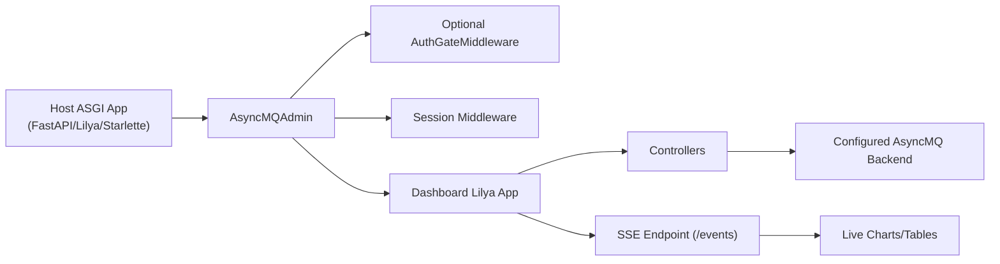
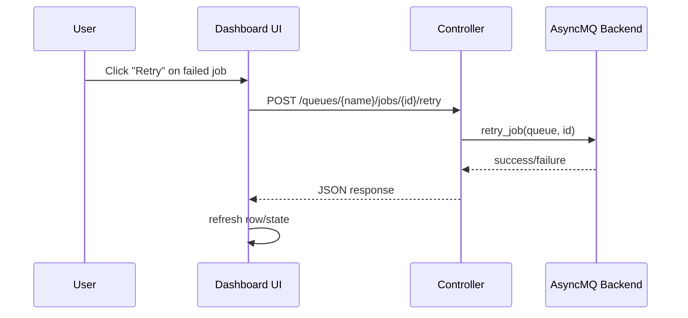

# Dashboard

AsyncMQ ships a built-in dashboard ASGI app under `asyncmq.contrib.dashboard`.

Wrapper class: `AsyncMQAdmin`.

This dashboard is designed for queue operations visibility and safe controls, similar in spirit to Flower-style day-to-day operations (queue health, failed-job handling, worker visibility, and live updates).

Related pages:
- [Dashboard Capabilities](capabilities.md)
- [Dashboard Operations Playbook](operations.md)
- [Authentication Backends](jwt.md)

## Architecture



## What the Dashboard Covers

| Area | Route | Primary Actions |
| --- | --- | --- |
| Overview | `/` | queue/job/worker totals, live charts, latest jobs/queues |
| Queues | `/queues` | inspect queue state, pause/resume |
| Queue Details | `/queues/{name}` | queue-level status and controls |
| Jobs | `/queues/{name}/jobs` | filter by state, retry/remove/cancel |
| Job Actions | `/queues/{name}/jobs/{job_id}/{action}` | single-action API endpoint |
| DLQ | `/queues/{name}/dlq` | retry/remove failed jobs |
| Repeatables | `/queues/{name}/repeatables` | pause/resume/remove repeatable definitions |
| New Repeatable | `/queues/{name}/repeatables/new` | create repeatable definition |
| Workers | `/workers` | active worker visibility |
| Metrics | `/metrics` | throughput/retry/failure summaries |
| SSE Stream | `/events` | pushes live updates to UI |

## Quick Start

```python
from asyncmq.contrib.dashboard.admin import AsyncMQAdmin

admin = AsyncMQAdmin(enable_login=False)
```

### Lilya

```python
from lilya.apps import Lilya
from asyncmq.contrib.dashboard.admin import AsyncMQAdmin

app = Lilya()
admin = AsyncMQAdmin(enable_login=False)
admin.include_in(app)
```

### FastAPI / Starlette

```python
from fastapi import FastAPI
from starlette.middleware.sessions import SessionMiddleware
from asyncmq.contrib.dashboard.admin import AsyncMQAdmin

app = FastAPI()
app.add_middleware(SessionMiddleware, secret_key="change-me")

admin = AsyncMQAdmin(enable_login=False)
app.mount("/", admin.get_asgi_app(with_url_prefix=True))
```

## Configuring Look and Mount Prefix

`settings.dashboard_config` returns `DashboardConfig`.

```python
from asyncmq.conf.global_settings import Settings
from asyncmq.core.utils.dashboard import DashboardConfig


class AppSettings(Settings):
    secret_key = "replace-in-production"

    @property
    def dashboard_config(self) -> DashboardConfig:
        return DashboardConfig(
            title="My AsyncMQ",
            header_title="Background Jobs",
            description="Queue operations",
            dashboard_url_prefix="/admin",
            sidebar_bg_colour="#CBDC38",
            secret_key=self.secret_key,
        )
```

## Authentication

Set `enable_login=True` and provide an `AuthBackend` implementation.

Built-ins:
- `SimpleUsernamePasswordBackend`
- `JWTAuthBackend`

See [Authentication Backends](jwt.md).

## Live Updates (SSE)

Dashboard pages use the `/events` SSE stream to update charts and tables in near real time.

Current event types emitted:
- `overview`
- `jobdist`
- `metrics`
- `queues`
- `workers`
- `latest_jobs`
- `latest_queues`

## Operator Workflows

### 1. Pause a noisy queue

1. Open `/queues`.
2. Select queue card or detail page.
3. Click pause action.
4. Verify state changes to paused.

### 2. Recover from failure burst

1. Open `/queues/{name}/dlq`.
2. Select affected jobs.
3. Retry jobs after fixing root cause.
4. Monitor `/metrics` and `/queues/{name}/jobs?state=failed`.

### 3. Confirm worker availability

1. Open `/workers`.
2. Validate heartbeat recency and queue assignment.
3. Cross-check queue backlog on `/queues`.

## Request Flow Example



## Production Guidance

- keep dashboard behind authentication and HTTPS
- use non-default secrets for session/JWT
- restrict network exposure to operator/admin paths
- keep worker and dashboard on the same backend configuration source

## Flower-Level Capability Notes

For a direct capability matrix (supported vs current limits), see [Dashboard Capabilities](capabilities.md).
