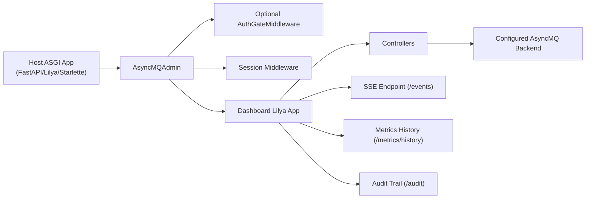
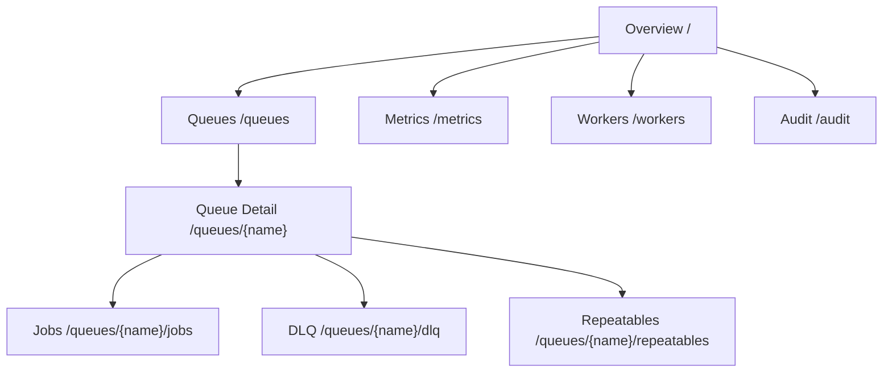
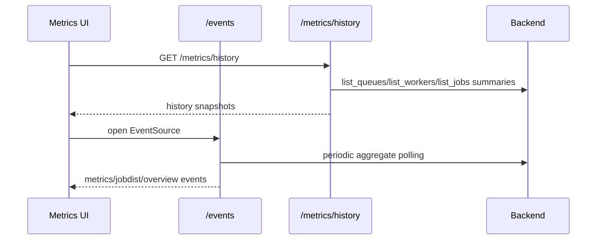

# Dashboard

AsyncMQ ships a built-in operations dashboard ASGI app in `asyncmq.contrib.dashboard`.

Wrapper class: `AsyncMQAdmin`

This dashboard is designed for day-to-day queue operations and incident response:

- queue, job, and worker visibility
- retry/remove/cancel controls
- DLQ and repeatable management
- action audit trail
- live + historical metrics views

Related pages:

- [Dashboard Capabilities](capabilities.md)
- [Dashboard Operations Playbook](operations.md)
- [Dashboard API and Route Reference](reference.md)
- [Authentication Backends](jwt.md)

## Architecture



## Visual Page Map



## What the Dashboard Covers

| Area | Route | Primary Actions |
| --- | --- | --- |
| Overview | `/` | queue/job/worker totals, live charts, latest jobs/queues |
| Queues | `/queues` | inspect queue state, pause/resume |
| Queue Details | `/queues/{name}` | queue-level status and controls |
| Jobs | `/queues/{name}/jobs` | state tabs, text search, task/id filters, retry/remove/cancel |
| DLQ | `/queues/{name}/dlq` | retry/remove failed jobs |
| Repeatables | `/queues/{name}/repeatables` | pause/resume/remove repeatable definitions |
| Workers | `/workers` | active worker visibility |
| Metrics | `/metrics` | throughput/retry/failure cards, history charts/tables |
| Metrics History API | `/metrics/history` | JSON snapshots for historical chart/table rendering |
| Audit Trail | `/audit` | searchable log of queue/job/dlq/repeatable actions |
| SSE Stream | `/events` | near-real-time updates to UI cards/charts/tables |

## Quick Start

```python
from asyncmq.contrib.dashboard.admin import AsyncMQAdmin

admin = AsyncMQAdmin(enable_login=False)
```

### Lilya

```python
from lilya.apps import Lilya
from asyncmq.contrib.dashboard.admin import AsyncMQAdmin

app = Lilya()
admin = AsyncMQAdmin(enable_login=False)
admin.include_in(app)
```

### FastAPI / Starlette

```python
from fastapi import FastAPI
from starlette.middleware.sessions import SessionMiddleware
from asyncmq.contrib.dashboard.admin import AsyncMQAdmin

app = FastAPI()
app.add_middleware(SessionMiddleware, secret_key="change-me")

admin = AsyncMQAdmin(enable_login=False)
app.mount("/", admin.get_asgi_app(with_url_prefix=True))
```

## Configuring Look and Mount Prefix

`settings.dashboard_config` returns `DashboardConfig`.

```python
from asyncmq.conf.global_settings import Settings
from asyncmq.core.utils.dashboard import DashboardConfig


class AppSettings(Settings):
    secret_key = "replace-in-production"

    @property
    def dashboard_config(self) -> DashboardConfig:
        return DashboardConfig(
            title="My AsyncMQ",
            header_title="Background Jobs",
            description="Queue operations",
            dashboard_url_prefix="/admin",
            sidebar_bg_colour="#CBDC38",
            secret_key=self.secret_key,
        )
```

## High-Value Workflows

### 1. Find and retry a bad job quickly

1. Open `/queues/{name}/jobs?state=failed`.
2. Narrow results with `task=...`, `job_id=...`, or `q=...`.
3. Trigger `Retry` on selected jobs.
4. Verify action visibility in `/audit`.

Example filter URL:

```text
/queues/emails/jobs?state=failed&task=send-reminder&q=tenant-42&sort=newest
```

### 2. Track operator actions during an incident

1. Open `/audit`.
2. Filter by `queue`, `status=failed`, or a specific `action`.
3. Search free-text (`q`) across action/source/error/details.

Example filter URL:

```text
/audit?action=job.retry&queue=emails&status=success&limit=100
```

### 3. Investigate recent throughput and failure trend

1. Open `/metrics`.
2. Use live charts and the "Recent Metrics History" table.
3. Correlate with queue backlog and worker counts.
4. Pull raw snapshots from `/metrics/history` if needed for tooling.

```bash
curl -s http://localhost:8000/metrics/history?limit=20
```

## Data Flow for Metrics



## Authentication

Set `enable_login=True` and provide an `AuthBackend` implementation.

Built-ins:

- `SimpleUsernamePasswordBackend`
- `JWTAuthBackend`

See [Authentication Backends](jwt.md).

## Production Guidance

- Keep dashboard behind authentication and HTTPS.
- Use non-default session/JWT secrets.
- Restrict dashboard network exposure to operator/admin paths.
- Treat dashboard actions as operational controls and keep an audit review process.
- Use external observability for long-term analytics/retention.

For capability boundaries, see [Dashboard Capabilities](capabilities.md).
