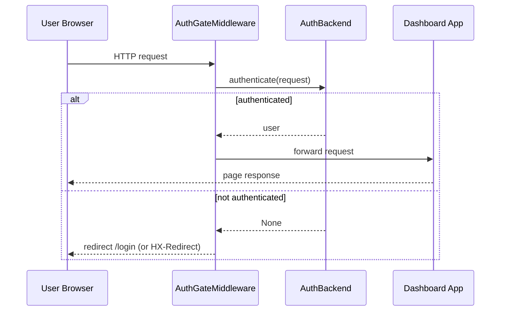

# Authentication Backends

Dashboard auth is pluggable via the `AuthBackend` protocol.

## Auth Flow



## JWTAuthBackend

`JWTAuthBackend` validates `Authorization: Bearer <token>` headers with PyJWT.

```python
from asyncmq.contrib.dashboard.admin import AsyncMQAdmin
from asyncmq.contrib.dashboard.admin.backends.jwt import JWTAuthBackend

backend = JWTAuthBackend(
    secret="change-me",
    algorithms=["HS256"],
    audience=None,
    issuer=None,
    user_claim="sub",
    user_name_claim="name",
    leeway=0,
)

admin = AsyncMQAdmin(enable_login=True, backend=backend)
```

Behavior:
- `authenticate()` decodes token and returns user dict (`id`, `name`, `claims`) or `None`.
- `login()` returns informational HTML (no form-based JWT issuance).
- `logout()` redirects to `/login`.

Install:

```bash
pip install pyjwt
```

### Token Creation Example

```python
import jwt

payload = {"sub": "ops-user", "name": "Ops User"}
token = jwt.encode(payload, "change-me", algorithm="HS256")
print(token)
```

Use in request header:

```text
Authorization: Bearer <token>
```

## SimpleUsernamePasswordBackend

Session-backed auth using a synchronous `verify(username, password)` callback.

```python
from asyncmq.contrib.dashboard.admin import AsyncMQAdmin
from asyncmq.contrib.dashboard.admin.backends.simple_user import (
    SimpleUsernamePasswordBackend,
)
from asyncmq.contrib.dashboard.admin.protocols import User


def verify(username: str, password: str) -> User | None:
    if username == "admin" and password == "secret":
        return User(id="admin", name="Admin", is_admin=True)
    return None


backend = SimpleUsernamePasswordBackend(verify=verify)
admin = AsyncMQAdmin(enable_login=True, backend=backend)
```

## Security Checklist

1. Enforce HTTPS.
2. Rotate JWT/session secrets.
3. Use narrow audience/issuer checks for JWT where possible.
4. Keep auth backend errors opaque to clients.
5. Limit dashboard exposure to trusted operator networks.
