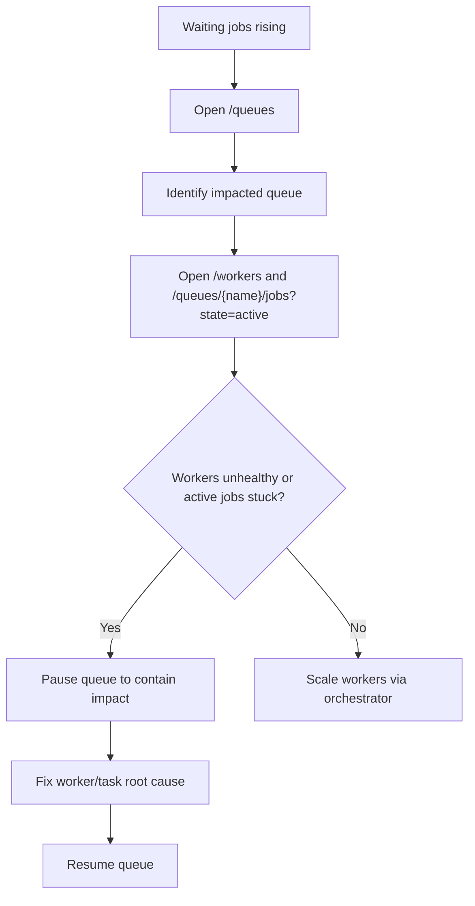
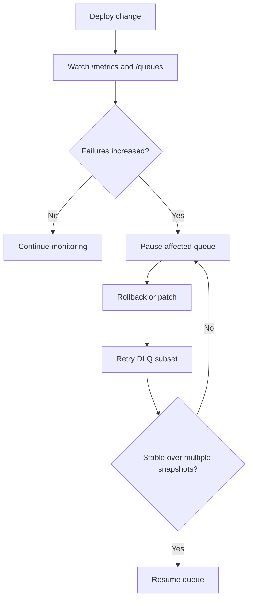

# Dashboard Operations Playbook

This playbook gives practical, repeatable response flows for common incidents.

## Daily Health Check (5 minutes)

1. Open `/` (overview).
2. Confirm `total_workers` is near expected baseline.
3. Check failed/retry movement on `/metrics`.
4. Review queue backlog on `/queues`.
5. Scan `/audit` for unexpected destructive actions.

## Incident: Queue Backlog Rising



Checklist:

- Capture queue name and backlog change rate.
- Confirm worker heartbeat recency.
- Verify active-job payload pattern (single task type vs broad).
- Pause queue only when downstream impact is unacceptable.

## Incident: Failure Spike

1. Open `/queues/{name}/dlq`.
2. Sample failed payloads and trace common error shape.
3. Open `/audit?queue={name}&action=job.retry` to review recent retry operations.
4. Fix root cause in task or dependency.
5. Retry a controlled subset first.
6. Watch `/metrics` and `/queues/{name}/jobs?state=failed` for regression.

### Suggested phased retry

- Phase 1: retry 5 to 10 representative jobs.
- Phase 2: retry next 10%.
- Phase 3: full retry once error rate stabilizes.

## Incident: Misbehaving Job Payload

1. Search in `/queues/{name}/jobs` using `job_id`, `task`, and `q`.
2. Cancel if currently harmful.
3. Remove if payload is poison and should never rerun.
4. Document action and rationale in incident notes.
5. Verify action exists in `/audit`.

Example URL:

```text
/queues/billing/jobs?state=active&task=invoice.charge&q=tenant-88
```

## Incident: Suspicious Operator Activity

1. Open `/audit`.
2. Filter by `status=failed` and target `queue`.
3. Search by actor id (`q=<actor-id>`) or action (`action=queue.pause`).
4. Cross-check with deployment timeline and on-call logs.

## Metrics Triage Pattern

Use `/metrics` with two time horizons:

- Short horizon (live SSE): immediate reactions after a retry/pause/resume action.
- Recent horizon (`/metrics/history`): trend direction and whether changes are stabilizing.

## Change Management Example



## Practical Limits

- Dashboard actions invoke backend APIs; they do not replace process orchestration.
- Metrics history and audit data are in-memory dashboard process stores.
- For durable long-term analytics/audit retention, export data to external observability tooling.
