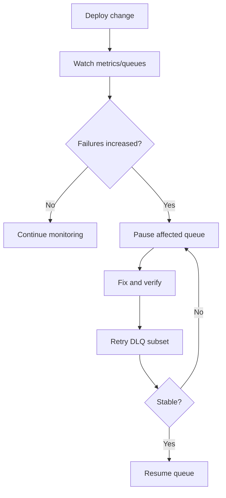

# Dashboard Operations Playbook

## Daily Health Check

1. Open `/` (overview).
2. Confirm worker count is stable.
3. Watch failed/retry trends on `/metrics`.
4. Inspect queue backlog on `/queues`.

## Incident: Queue Backlog Rising

1. Open `/queues` and identify queue with growing waiting jobs.
2. Open `/workers` and verify worker heartbeats for that queue.
3. Check `/queues/{name}/jobs?state=active` for stuck active tasks.
4. If needed, pause queue to reduce downstream pressure while investigating.

## Incident: Failure Spike

1. Open `/queues/{name}/dlq`.
2. Inspect representative failed payloads.
3. Fix root cause in task code/dependency.
4. Retry affected jobs from DLQ.
5. Monitor metrics and failed state after retry.

## Incident: Misbehaving Job

1. Locate job in `/queues/{name}/jobs`.
2. Cancel if currently harmful.
3. Remove if payload is poison and should not be retried.
4. Add guardrails (validation/idempotency/backoff) in handler.

## Change Management Example

## Practical Limits

- Dashboard actions are backend API calls; they do not replace process orchestration.
- Long-term history/reporting should be handled by external observability tooling.
