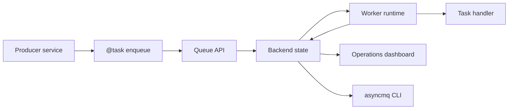

# AsyncMQ

<p align="center">
  <a href="https://asyncmq.dymmond.com"></a>
</p>

<p align="center">
  <strong>Async task queues, workers, retries, scheduling, and operations visibility for Python.</strong>
</p>

<p align="center">
  <a href="https://github.com/dymmond/asyncmq/actions/workflows/test-suite.yml/badge.svg?event=push&branch=main" target="_blank">
    
  </a>
  <a href="https://pypi.org/project/asyncmq" target="_blank">
    
  </a>
  <a href="https://img.shields.io/pypi/pyversions/asyncmq.svg?color=%2334D058" target="_blank">
    
  </a>
</p>

---

AsyncMQ is a background job runtime for Python services built on `asyncio` and
`anyio`. It provides task registration for Python applications, durable queue
backends, workers, retries, delayed jobs, repeatables, flow primitives, a CLI,
and a packaged operations dashboard.

Use AsyncMQ when you want a queue system that is owned by your Python services
and deployable with your existing infrastructure.

## What You Get

- `@task` registration with `.enqueue()`, `.delay()`, and `.send()` helpers.
- Queue APIs for job creation, pause/resume, cleanup, cancellation, retry, and DLQ operations.
- Worker runtime for async handlers, concurrency, heartbeat metadata, retries, and lifecycle hooks.
- Backend support for Redis, PostgreSQL, MongoDB, RabbitMQ, and in-memory development.
- Repeatable jobs, delayed jobs, dependencies, and flow orchestration.
- A Sayer-powered `asyncmq` CLI for production inspection and operations.
- A native Lilya/Jinja dashboard with packaged assets and no frontend build step.

AsyncMQ is not a hosted queue service and does not remove the need for
idempotent task handlers. Production systems should assume jobs can be retried.

## First Run

Install AsyncMQ:

```bash
pip install asyncmq
```

Create settings:

```python
# myapp/settings.py
from asyncmq.backends.memory import InMemoryBackend
from asyncmq.conf.global_settings import Settings


class AppSettings(Settings):
    backend = InMemoryBackend()
    worker_concurrency = 1
```

```bash
export ASYNCMQ_SETTINGS_MODULE=myapp.settings.AppSettings
```

Define a task:

```python
# myapp/tasks.py
from asyncmq.tasks import task


@task(queue="emails", retries=2, ttl=300)
async def send_welcome(email: str) -> str:
    return f"sent welcome email to {email}"
```

Enqueue work:

```python
# producer.py
import anyio

from asyncmq.queues import Queue
from myapp.tasks import send_welcome


async def main() -> None:
    queue = Queue("emails")
    job_id = await send_welcome.enqueue("alice@example.com", backend=queue.backend)
    print("enqueued", job_id)


anyio.run(main)
```

Run a worker:

```bash
asyncmq worker start emails --concurrency 1
```

Inspect state:

```bash
asyncmq queue list
asyncmq queue info emails
asyncmq job list --queue emails --state waiting
asyncmq job list --queue emails --state failed
```

Continue with the [Quickstart](features/quickstart.md) and
[Core Concepts](features/core-concepts.md).

## Production Pattern

For production, put the backend configuration in one settings class and use the
same `ASYNCMQ_SETTINGS_MODULE` in producers, workers, the CLI, and the
dashboard service.

```python
# myapp/settings.py
from asyncmq.backends.redis import RedisBackend
from asyncmq.conf.global_settings import Settings
from asyncmq.core.utils.dashboard import DashboardConfig


class AppSettings(Settings):
    secret_key = "replace-with-a-secret-from-your-secret-manager"
    backend = RedisBackend("redis://redis:6379/0")
    worker_concurrency = 8
    scan_interval = 1.0

    @property
    def dashboard_config(self) -> DashboardConfig:
        return DashboardConfig(
            secret_key=self.secret_key,
            dashboard_url_prefix="/asyncmq",
            path="/asyncmq",
            https_only=True,
        )
```

Run workers wherever they belong:

```bash
ASYNCMQ_SETTINGS_MODULE=myapp.settings.AppSettings \
asyncmq worker start emails --concurrency 8
```

Run the dashboard as a separate ASGI service if you want:

```python
# myapp/dashboard.py
from lilya.apps import Lilya

from asyncmq.contrib.dashboard.admin import AsyncMQAdmin

app = Lilya()
admin = AsyncMQAdmin(
    enable_login=True,
    backend=auth_backend,  # Provide an AuthBackend implementation.
    url_prefix="/asyncmq",
)
admin.include_in(app)
```

The dashboard reads the same backend evidence as the workers. It does not need
to run in the same process as a worker.

## Operations Dashboard

The dashboard is an AsyncMQ-owned Lilya contrib app rendered with Jinja
templates. It ships packaged Alpine.js, Tailwind CSS, Chart.js, dashboard CSS,
and JavaScript assets, so it does not require Node.js, a frontend build
pipeline, or a public CDN at runtime.

It covers:

- queue and job inspection
- worker status and heartbeat freshness
- failed job diagnostics with redacted payloads and tracebacks
- DLQ and repeatable operations
- metrics, runtime events, and audit history
- deployments behind reverse proxies at `/`, `/asyncmq/`, and nested paths such as `/operations/asyncmq/`

Start with the [Dashboard guide](dashboard/dashboard.md), then use the
[Dashboard Operations Playbook](dashboard/operations.md) for day-to-day
incident workflows.

## Runtime Shape



## Where To Go Next

| Goal | Start Here |
| --- | --- |
| Install and configure AsyncMQ | [Installation](installation.md) |
| Run your first job | [Quickstart](features/quickstart.md) |
| Understand runtime concepts | [Core Concepts](features/core-concepts.md) |
| Define tasks | [Tasks](features/tasks.md) |
| Work with queues and jobs | [Queues](features/queues.md), [Jobs](features/jobs.md) |
| Run workers safely | [Workers](features/workers.md) |
| Schedule repeatable work | [Schedulers](features/schedulers.md) |
| Model dependencies and flows | [Flows](features/flows.md) |
| Operate from the CLI | [CLI](features/cli.md), [CLI Reference](reference/cli-reference.md) |
| Deploy the dashboard | [Dashboard](dashboard/dashboard.md) |
| Prepare production systems | [Production Operations](learn/production-operations.md), [Deployment](learn/deployment.md) |
| Tune performance | [Performance Tuning and Benchmarks](learn/performance-tuning-and-benchmarks.md) |
| Migrate BullMQ concepts | [BullMQ Migration](reference/bullmq-migration.md) |
| Debug failures | [Troubleshooting](troubleshooting.md) |
