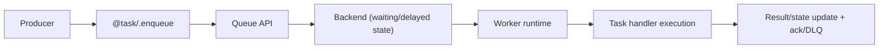

# AsyncMQ

<p align="center">
  <a href="https://asyncmq.dymmond.com"></a>
</p>

<p align="center">
  <span>⚡ Supercharge your async applications with tasks so fast, you'll think you're bending time itself. ⚡</span>
</p>

<p align="center">
  <a href="https://github.com/dymmond/asyncmq/actions/workflows/test-suite.yml/badge.svg?event=push&branch=main" target="_blank">
    
  </a>
  <a href="https://pypi.org/project/asyncmq" target="_blank">
    
  </a>
  <a href="https://img.shields.io/pypi/pyversions/asyncmq.svg?color=%2334D058" target="_blank">
    
  </a>
  <a href="https://codspeed.io/dymmond/asyncmq?utm_source=badge" target="_blank">
    
  </a>
</p>

---

**Documentation**: [https://asyncmq.dymmond.com](https://asyncmq.dymmond.com) 📚

**Source Code**: [https://github.com/dymmond/asyncmq](https://github.com/dymmond/asyncmq)

**The official supported version is always the latest released**.

---

AsyncMQ is an asynchronous Python job queue focused on `asyncio`/`anyio` workloads.

It gives you:
- task registration via `@task`
- queue and worker runtime APIs
- delayed jobs, retries/backoff, TTL expiration, and dead-letter routing
- multiple backends (`Redis`, `Postgres`, `MongoDB`, `RabbitMQ`, in-memory)
- a CLI (`asyncmq`) and a built-in dashboard app

## What AsyncMQ Is (and Is Not)

AsyncMQ is:

- a library-first queue/worker runtime you embed in Python apps
- backend-pluggable through a shared `BaseBackend` contract
- suitable for both local development and production deployments

AsyncMQ is not:

- a hosted queue service
- a guaranteed exactly-once execution system
- a replacement for domain-level idempotency in your task code

## Architecture Overview

At runtime, AsyncMQ has four main layers:

1. Task registration: `@task(queue=...)` stores handlers in `TASK_REGISTRY` and adds `.enqueue()` helpers.
2. Queue API: `Queue` wraps backend operations (`enqueue`, `pause`, `list_jobs`, delayed/repeatable APIs).
3. Worker runtime: `process_job`/`handle_job` run tasks, manage state transitions, retries, and acknowledgements.
4. Backend and store: concrete backends persist job state and queue metadata.

For an end-to-end walkthrough, start with [Core Concepts](features/core-concepts.md).



## Feature Map

- [Installation](installation.md)
- [Quickstart](features/quickstart.md)
- [Tasks](features/tasks.md)
- [Queues](features/queues.md)
- [Workers](features/workers.md)
- [CLI](features/cli.md)
- [Dashboard](dashboard/dashboard.md)
- [Troubleshooting](troubleshooting.md)

## Minimal Quickstart (In-Memory)

Use in-memory backend first so you can run without Redis/Postgres.

```python
# myapp/settings.py
from asyncmq.backends.memory import InMemoryBackend
from asyncmq.conf.global_settings import Settings


class AppSettings(Settings):
    backend = InMemoryBackend()
```

```bash
export ASYNCMQ_SETTINGS_MODULE=myapp.settings.AppSettings
```

```python
# myapp/tasks.py
from asyncmq.tasks import task


@task(queue="emails", retries=2, ttl=300)
async def send_welcome(email: str) -> None:
    print(f"sent welcome email to {email}")
```

```python
# producer.py
import anyio
from asyncmq.queues import Queue
from myapp.tasks import send_welcome


async def main() -> None:
    queue = Queue("emails")
    job_id = await send_welcome.enqueue("alice@example.com", backend=queue.backend)
    print("enqueued", job_id)


anyio.run(main)
```

```bash
asyncmq worker start emails --concurrency 1
```

## Next Steps

1. Configure your target backend in [Settings](features/settings.md).
2. Add failure handling and retries with [Jobs](features/jobs.md) and [Workers](features/workers.md).
3. Add operations visibility with the [Dashboard](dashboard/dashboard.md) and [CLI reference](reference/cli-reference.md).
